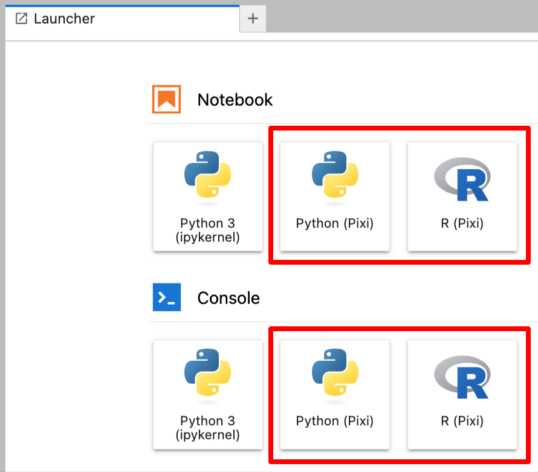

# Pixi Hub

This repository is intended for use with repo2docker.  It simply adds
`pixi-kernel` (via `environment.yml`) to the default list of dependencies, and
installs `pixi` (via `postBuild`) on the `PATH` so that it is accessible to the
Jupyter Server.

With `pixi-kernel` added to the dependencies, after launching a JupyterHub
environment via repo2docker, the Launcher will show additional Notebook and
Console options:

Additionally, for each repository cloned to your environment where you want to
open a notebook or console and use the Pixi kernel, you need only include
`ipykernel` in your dependencies list.  Of course, this is in addition to using
`pixi` for managing the dependencies in eash such repository.
